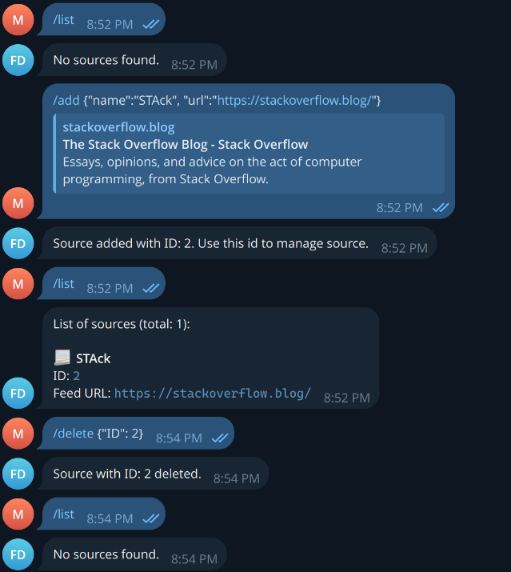

Digest bot is telegram bot that publish articles based on list of provided sources.

## How to use
1. Clone the repository
2. Install dependencies
    ```bash
    go mod tidy
    ```
3. Docker compose up
4. Apply migrations
5. Create config file based on example.config.hcl
6. Run the bot
    ```bash
    go run cmd
    ```


## Features
- [x] Fetch articles from RSS feeds
- [x] Publish articles to telegram channel
- [x] Save articles to database
- [x] Save sources to database
- [x] Delete source from database

## screenshots
